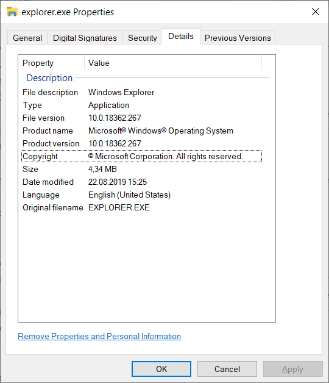

# go-fileversion

[](https://godoc.org/github.com/bi-zone/go-fileversion/)
[](https://goreportcard.com/report/github.com/bi-zone/go-fileversion)

Package `fileversion` provides wrapper for querying properties from windows version-information resource.

Using the package you can extract the following info:



If you are looking how to add this info to your go binary - look at [josephspurrier/goversioninfo](https://github.com/josephspurrier/goversioninfo).

## Examples

Print version info from input file
```golang
package main

import (
	"fmt"
	"log"
	"os"

	"github.com/bi-zone/go-fileversion"
)

func main() {
	if len(os.Args) < 2 {
		log.Fatalf("Usage: %s <image-path>", os.Args[0])
	}
	f, err := fileversion.New(os.Args[1])
	if err != nil {
		log.Fatal(err)
	}
	fmt.Println("ProductName:", f.ProductName())
	fmt.Println("LegalCopyright:", f.LegalCopyright())
	fmt.Println("Version:", f.FixedInfo().FileVersion)
}
```

All string properties in file version-information resource by-design has multiple translations. 
`go-fileversion` allows you to query that translations in a 2 ways. 

You can create an `Info` object with "preferred" locale:

```golang
germanLocale := fileversion.Locale{
    LangID: 0x0407, // langID German
    CharsetID: fileversion.CSUnicode,
}
f, err := fileversion.NewWithLocale(os.Args[1], germanLocale)
if err != nil {
    log.Fatal(err)
}
fmt.Println("ProductName:", f.ProductName())
```

Here "German-Unicode" locale will be used to query string properties (like `ProductName`), 
**but if the german translation will be missing - `go-fileversion` would try to fetch a 
property with default translation**. (The idea of locales handling was copied from 
[.NET Framework 4.8](https://referencesource.microsoft.com/#System/services/monitoring/system/diagnosticts/FileVersionInfo.cs,036c54a4aa10d39f,references))

The only way to get necessary translation without any heuristics is to use `GetPropertyWithLocale` manualy:
```golang
f, err := fileversion.New(os.Args[1])
if err != nil {
    log.Fatal(err)
}
germanLocale := fileversion.Locale{
    LangID: 0x0407, // langID German
    CharsetID: fileversion.CSUnicode,
}
fmt.Println(f.GetPropertyWithLocale("ProductName", germanLocale))
```

## Versioning

Project uses [semantic versioning](http://semver.org) for version numbers, which
is similar to the version contract of the Go language. Which means that the major
version will always maintain backwards compatibility with minor versions. Minor 
versions will only add new additions and changes. Fixes will always be in patch. 

This contract should allow you to upgrade to new minor and patch versions without
breakage or modifications to your existing code. Leave a ticket, if there is breakage,
so that it could be fixed.